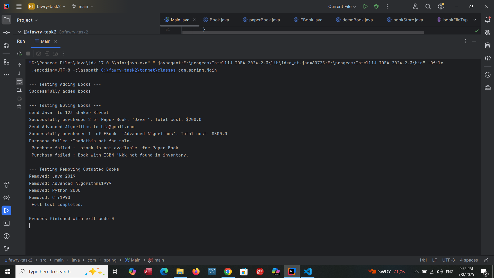

# `Quantum BookStore` 

## Introduction:

The Quantum Bookstore is a Java-based object-oriented programming (OOP) project designed to simulate an online book store. It manages an inventory of various book types, handles adding and removing books, and processes purchase transactions. The system is built with a strong emphasis on extensibility, allowing for the seamless integration of new book types without requiring significant modifications to existing code.

## Screenshots for test case:

## `TestClass`

Main Class  
  

## `Console Output`

Console Output  
  

  

## Things and Tools I Used in this project:
<li> IntellIJ IDE </li>
<li> Java 8 </li>
<li>OOP<li>
